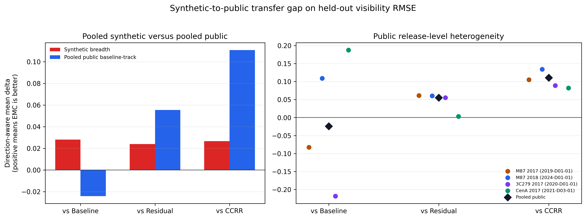

# dynadiff-vlbi — an evaluation protocol that catches "data consistency" cheating, and a method that fails it on real data

In inverse problems, agreeing with the measurements you were *given* is circular: the
reconstruction was projected onto them. This repository holds out a subset of the observed
visibilities from **both** the model input **and** the data-consistency projection, then
scores on measurements the method never saw and was never forced to match — *earned* rather
than *enforced* consistency.

The method wins **12 / 12** synthetic cells under that protocol and loses **25 / 32** cells on
four official Event Horizon Telescope data releases. Both tables are published below.

[](https://github.com/stelioszach03/dynadiff-vlbi/actions)
[](LICENSE)
[](https://www.python.org/)
[](https://pytorch.org/)

Solo research project by Stelios Zacharioudakis.
**Manuscript only — not published, not peer-reviewed, not submitted to any venue.**



---

## Results

Δ is the EMC-minus-comparator gap on **held-out visibility RMSE**; positive means EMC is
better. `μ²k/(αm)` is the Theorem-2 condition number, which predicts that adaptive
partitioning only helps when it is ≪ 1. `Δ_det` uses the deterministic partition, `Δ_adap` the
adaptive one.

Evidence for both tables:
[`paper/tables/adaptive_partition_results.tex`](paper/tables/adaptive_partition_results.tex).

### Synthetic (`default32`) — 3 holdout families × 4 support fractions

| Family | α | μ²k/(αm) | Δ_det | Δ_adap |
|---|---:|---:|---:|---:|
| baseline tracks | 0.20 | 2.42 | +0.0754 | +0.1109 |
| baseline tracks | 0.80 | 0.61 | +0.0212 | **+0.1864** |
| scan segments | 0.20 | 20.00 | +0.0572 | +0.0527 |
| scan segments | 0.80 | 5.00 | +0.0233 | +0.1261 |
| station dropout | 0.20 | 13.33 | +0.0303 | +0.0428 |
| station dropout | 0.80 | 3.33 | +0.0191 | +0.1248 |

**All 12 synthetic cells are positive on both partitions.**

### Public EHT — 4 releases × 2 holdout families × 4 support fractions = 32 cells

| Release | Family | α | Δ_det | Δ_adap |
|---|---|---:|---:|---:|
| M87 2017 | station dropout | 0.20 | −0.0111 | **+0.0108** |
| M87 2018 | station dropout | 0.60 | −0.0679 | −0.0975 |
| M87 2018 | station dropout | 0.80 | −0.0596 | −0.0936 |
| 3C 279 2017 | baseline track blocks | 0.80 | **+0.0222** | −0.0217 |
| CenA 2017 | baseline track blocks | 0.80 | **+0.0317** | −0.1116 |
| CenA 2017 | station dropout | 0.60 | −0.0681 | −0.0979 |

Across all 32 real-data cells: `Δ_det` is positive in **2**, `Δ_adap` in **4**, and **25 cells
are negative on both**. No cell is positive on both partitions. All four positive `Δ_adap`
cells come from a single release (M87 2017); the single largest negative value in the whole
table, `Δ_adap = −0.1116` on CenA 2017, sits in a cell where `Δ_det` is positive. The method
does not transfer from the synthetic regime to real EHT data.

### Why the failing table is here

[`benchmark/BENCHMARK_CARD.md`](benchmark/BENCHMARK_CARD.md) contains a **Stop rules** section
written before the results, including:

> If a method does not improve on the realism track, do not claim stronger realism
> performance; claim only the stronger evaluation principle if justified.
>
> If gains appear only in one holdout family, report partial robustness rather than broad
> generality.

The claim this repository makes is about the **evaluation protocol**, not about the method's
imaging quality on real interferometric data.

## Data

Public-release validation uses four official EHT calibrated-data releases, each with a DOI.
None of them are redistributed here.

| Release | Target | DOI |
|---|---|---|
| `2019-D01-01` | M87 (2017) | [10.25739/g85n-f134](https://doi.org/10.25739/g85n-f134) |
| `2024-D01-01` | M87 (2018) | [10.25739/epm5-r371](https://doi.org/10.25739/epm5-r371) |
| `2020-D01-01` | 3C 279 (2017) | [10.25739/vty0-ve39](https://doi.org/10.25739/vty0-ve39) |
| `2021-D03-01` | Centaurus A (2017) | [10.25739/kejs-2n22](https://doi.org/10.25739/kejs-2n22) |

## Quickstart — verified on macOS 15 / Python 3.11

```bash
python3.11 -m venv .venv && source .venv/bin/activate
pip install -e ".[dev]"

pytest -q      # 99 passed, 1 skipped in ~5 s — CPU only, no data download
```

The suite is fast because it runs on tiny synthetic fixtures. It includes a numerical
verification of the partial-DFT consistency bound
([`tests/test_partial_dft_bound.py`](tests/test_partial_dft_bound.py) against
[`theory/`](theory/)), a measurement-leakage audit
([`tests/test_measurement_audit.py`](tests/test_measurement_audit.py)) and a holdout-protocol
check ([`tests/test_emc_holdout.py`](tests/test_emc_holdout.py)).

The benchmark itself needs a GPU and real data:

```bash
python scripts/run_emc_benchmark.py --target all --skip-existing
python scripts/generate_emc_benchmark_artifacts.py
python scripts/generate_public_eht_suite_artifacts.py
```

## How the protocol works

```
observed visibilities
        │
        ├──────────────► support set S  ──► model input
        │                                └► data-consistency projection
        │
        └──────────────► target set T   ──► scoring only
                                            (never seen, never projected onto)
```

Three structured holdout families define how T is carved out — **baseline tracks**,
**scan segments**, **station dropout** — at support fractions α ∈ {0.2, 0.4, 0.6, 0.8}, all at
128×128 resolution. Structured holdouts matter: a random holdout is trivially interpolable
from neighbouring uv points, so it does not test anything.

The reference method (EMC) is a conditional score-based diffusion model — 3D U-Net backbone,
cross-attention on sparse Fourier measurements, consistency guidance applied **only** on S.
`src/dynadiff_vlbi/` holds `physics/` (partial-DFT operators), `models/`, `training/`,
`evaluation/`, `generalization/`, `oracle/`, `data/`.

## What this does not do

- **It does not work on real EHT data.** 25 of 32 public-release cells are negative on both
  partition strategies. Nothing in this repository supports a claim of better imaging quality
  on real interferometry.
- **The synthetic benchmark is not telescope-accurate.** `benchmark/BENCHMARK_CARD.md` states
  it directly: "This is a synthetic VLBI-inspired benchmark … It is not a telescope-accurate
  EHT or ngEHT evaluation suite."
- **Held-out visibility RMSE is a proxy.** It is not image fidelity, and it is not a
  science-grade metric that a radio astronomer would accept on its own.
- **Uncertainty is not calibrated**, and per the pre-registered stop rules it is therefore
  kept out of the main benchmark claim.
- **No comparison against established VLBI imaging pipelines** (CLEAN, RML, `eht-imaging`'s
  own reconstructions). The comparators are this repository's own baseline, residual-refinement
  and CCRR variants.
- **No error bars on the 44 cells.** Each is a single number from a single run per condition.
- **Reproducing the benchmark is expensive** and needs a GPU plus the four EHT releases
  downloaded separately. `outputs/`, `data/generated/`, `data/external/`, `data/real/` are all
  gitignored; only the aggregated tables, figures and manifests are tracked.
- **`ehtim` is an optional bridge**, not a dependency; the ehtim-backed paths are skipped when
  it is absent.

## Layout

```text
src/dynadiff_vlbi/   24,928 lines: physics, models, training, evaluation, oracle, utils
scripts/             CLI entry points: dataset generation, training, benchmarks, artifact builders
configs/             39 YAML presets — every run is a resolved config
tests/               24 files, 99 tests (CPU, seconds)
theory/              partial-DFT consistency bound + its numerical verification
benchmark/           BENCHMARK_CARD (with pre-registered stop rules), PROTOCOL_CARD,
                     PUBLIC_EHT_VALIDATION, EXPECTED_OUTPUTS, RELEASE_CHECKLIST, leaderboard template
paper/               manuscript sources, 27 figures (13 with .selection.json provenance files),
                     tables, supplementary GIFs
```

13 of the figures ship a `*.selection.json` recording which sample and frame it shows and the rule
that selected it — so a reader can check the figure was not cherry-picked.

## License

MIT — see [`LICENSE`](LICENSE). Citation metadata in [`CITATION.cff`](CITATION.cff).
